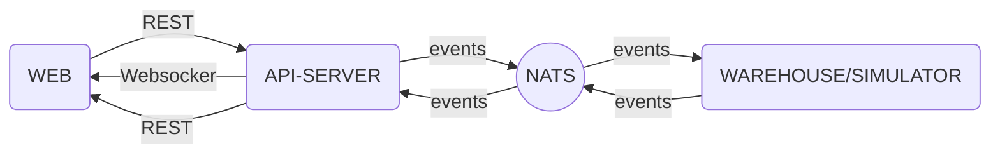
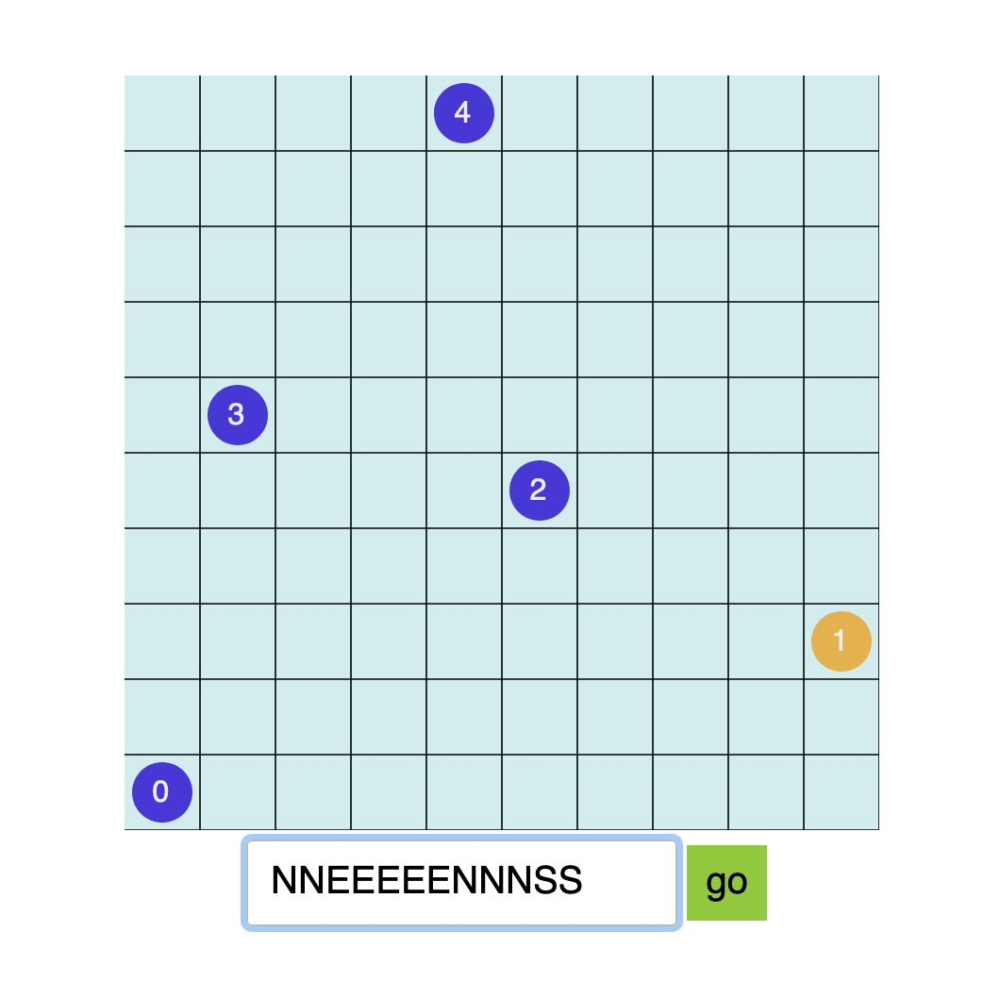

# Robot Warehouse

## introduction

This project consists of the following sub-projects:
- **api**
- **simulator**
- **web**

Also API definition is based on OpenAPI specification and the definition yaml file is located under **api-definition** directory. The SDK interface is implemented in **simulator** sub-project. 

Communication between **api** and **simulator** happens asynchronously via message queue. It is built this way to demonstrate that remote robots are not always connected to the cloud and I would like to reduce the impact of that on customer experience. 

It is using an event driven architecture to decouple the direct communication between customer and robots, hence allowing the robots to process the created tasks in an asynchronous way.  I have used  [NATS](https://nats.io/) message queue to achieve this.


## API-First approach

An API-first approach means that for any given development project, your APIs are treated as “first-class citizens.” That everything about a project revolves around the idea that the end product will be consumed by mobile devices, and that APIs will be consumed by client applications. 

I have used OpenAPI to define the contract between **web** and the **api-server**. I used [oapi-codegen](https://github.com/deepmap/oapi-codegen) to generate golang code for server interface and the models as well as validating the data structure coming through the API.

## code generation
I heavily rely on code generation in order to avoid mistakes. code generation is used to generate
server interface, models and mocked contracts to be used by our tests.

all the generated codes are already commited but you can regenerate them by running the following
command:

```bash
make generate
```

note that you need to have installed these binaries on your system in order for code generation
to work:

[oapi-codegen](https://github.com/deepmap/oapi-codegen)
[mock-gen](https://github.com/golang/mock)

## architecture


As can be seen in the diagram above, **api** and **simulator** are completely decoupled from each other and you can safely manipulate them separately as long as the contracts remains the same.

it is beyond the scope of this technical test but [AsyncAPI](https://www.asyncapi.com/)   contract can be used to define the contracts between **api** and **simulator**

## how to start the project

you can run the whole project by running:
```bash
docker-compose up --build -d
```
needless to say that you need to have docker and docker compose on your system.

## web 
there is also a little web dashboard that shows the grid and robots in a simple graphical way, you can interact with robots by selecting them and sending movement commands to the selected robot.

after starting the whole system using docker-compose, you can access the web by opening  [http://localhost:8080](http://localhost:8080) 



note that the web uses a hard-coded port to access websockets on **api**, so if you change the docker-compose configuration and change the ports for **api**, web would not be accessible anymore, but the rest of the system would work as expected

## unit test
to run unit tests execute the following command, this will look for all unit tests and will execute them.
```bash
make test
```

## integration test
I've implemented one simple integration test to demonstrate how a given component can be tested including all its external dependencies such as messaging system and/or api. to run the integration test run the following command:

```bash
simulator-integration-tests/run.sh
```

